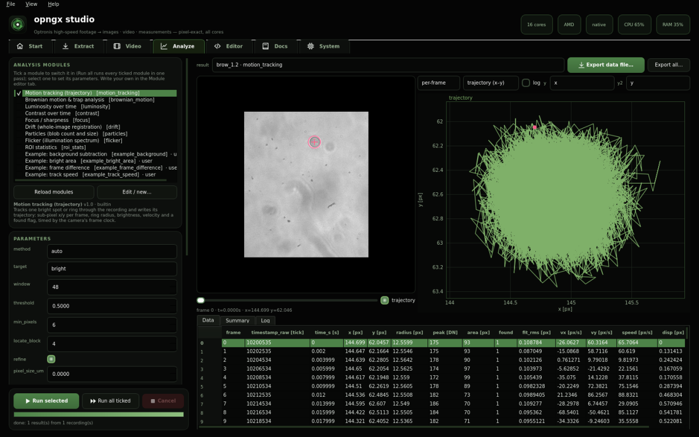
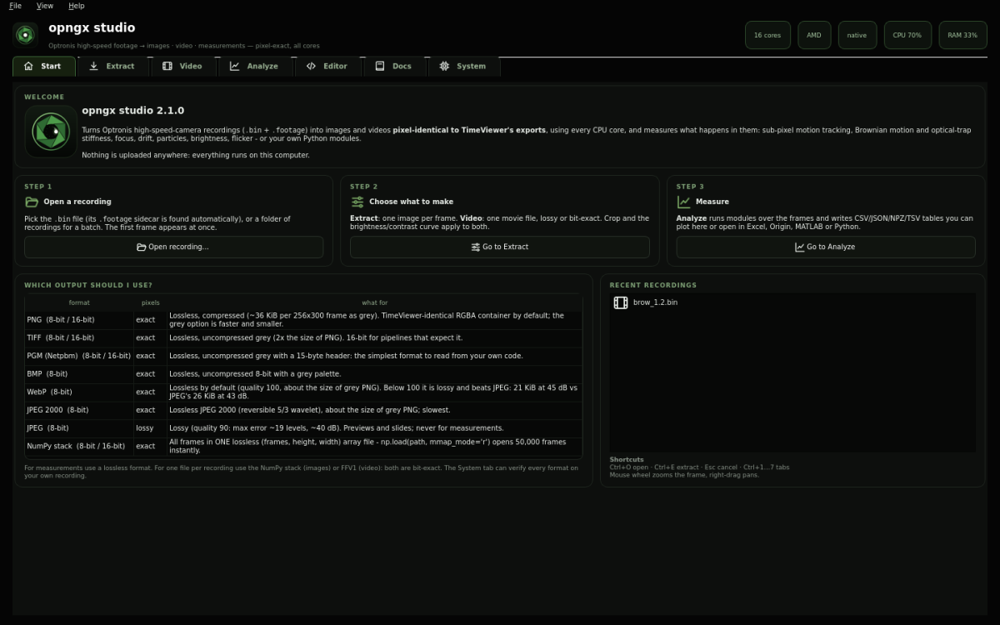
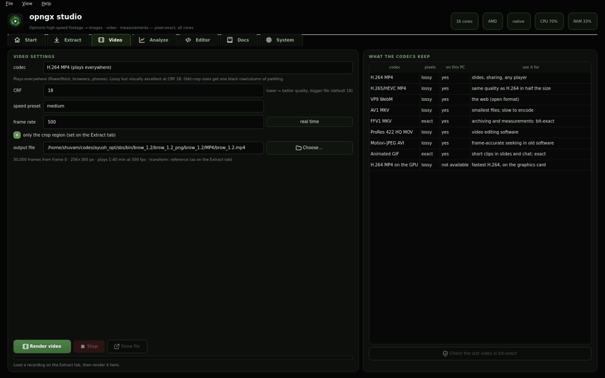
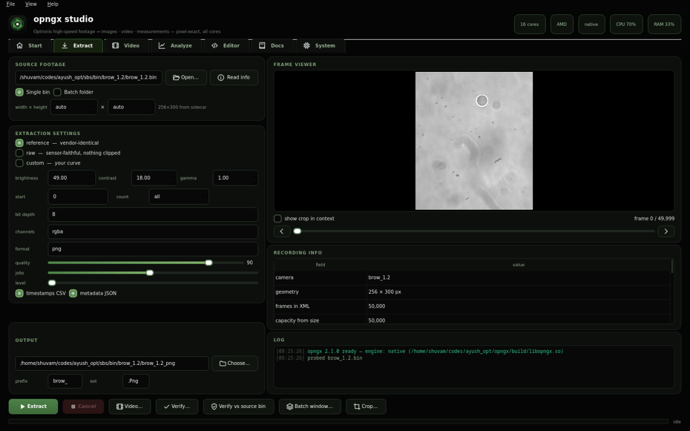
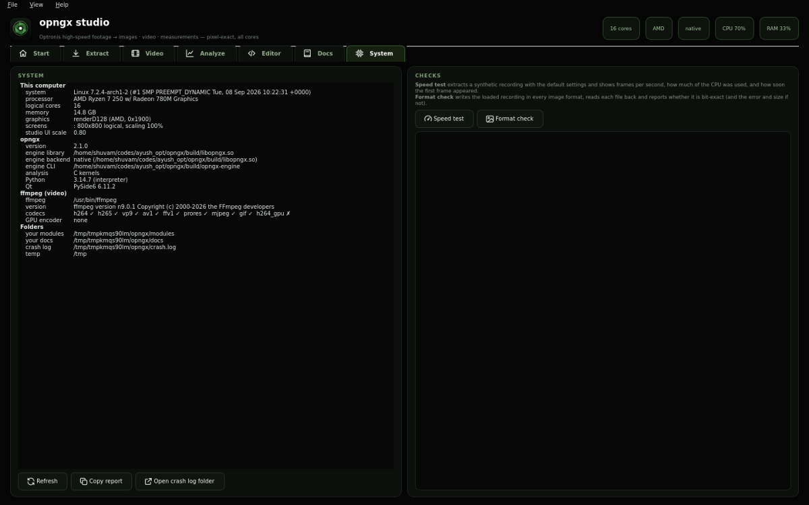

<p align="center"></p>

<p align="center"><b>Pixel-exact extraction, video export and analysis of Optronis TimeViewer high-speed-camera recordings.</b><br>
C engine on every core · Windows studio · Python package · Linux &amp; Windows</p>

```
3.6 GB .bin (50,000 frames) ──▶ 50,000 PNGs in ~10 s, pixel-identical to TimeViewer's export
                            ──▶ one lossless FFV1 video, bit-exact
                            ──▶ sub-pixel trajectory, trap stiffness, focus, drift, particles … as CSV
```

<p align="center"></p>

## What it does

**Extract** a recording (`.bin` + its `.footage` sidecar) to images:
- **Pixel-identical to TimeViewer.** Every one of the 250,000 frames of this
  project's recordings is verified against the vendor's own exports.
- **Formats:** PNG, TIFF and PGM (8 or 16 bit), BMP, lossless WebP, JPEG 2000, a
  single-file NumPy stack, or JPEG. Every lossless one is checked bit-exact.
- **Curve:** `reference` (the recording's own brightness/contrast/gamma), `raw`
  sensor values, or your own curve. Add a pixel-exact crop, and work on one
  recording or a whole folder of them.

**Render video** with the bundled ffmpeg:
- H.264, H.265, VP9, AV1, ProRes, Motion-JPEG, GIF, or H.264 on the GPU.
- **FFV1**, a lossless video whose every frame decodes to exactly the extracted
  pixels.

**Analyse** with switchable modules:
- **motion tracking:** a sub-pixel trajectory, 0.044 px rms on a ring;
- **Brownian motion and optical-trap analysis:** MSD, PSD with corner frequency,
  stiffness;
- **focus / sharpness**;
- **stage drift** (0.06 px rms);
- **particle counting** (C kernel);
- **illumination flicker:** it finds the 50/100 Hz mains lines;
- **luminosity**, **contrast** and **ROI statistics**;
- **your own Python modules**, written and tested in the studio.

| | |
|---|---|
|  |  |
| **Start**: the workflow, which format to choose, recent recordings | **Video**: every codec, with a bit-exactness check for FFV1/GIF |
|  |  |
| **Extract**: formats, curve, crop, batch, verify | **System**: diagnostics, speed test, format check |

## Install

**Windows:** download `opngx-setup-v2.1.0.exe` from the
[latest release](https://github.com/Shuvam-Banerji-Seal/opngx/releases/latest) and run it.
- **What you get:** the studio, the `opngx-engine` command-line tool, ffmpeg, the
  docs and the sample modules.
- **Where it goes:** your user only, so no admin rights are needed. It adds a
  Start-menu entry and is removable from *Settings → Apps*.
- **No install:** run `opngx-studio-portable-v2.1.0.exe` instead.

**Python (Linux x86_64 / Windows amd64, Python ≥ 3.9):** the wheels contain the compiled engine:

```bash
pip install https://github.com/Shuvam-Banerji-Seal/opngx/releases/download/v2.1.0/opngx-2.1.0-py3-none-manylinux2014_x86_64.manylinux_2_17_x86_64.whl
pip install "opngx[qt] @ https://github.com/Shuvam-Banerji-Seal/opngx/releases/download/v2.1.0/opngx-2.1.0-py3-none-win_amd64.whl"   # + the studio
```

The Linux wheel runs on any distro with glibc ≥ 2.17. The sdist
(`opngx-2.1.0.tar.gz`) installs anywhere and runs on numpy, producing the same
pixels more slowly.

**From source:**

```bash
cmake -S . -B build -DCMAKE_BUILD_TYPE=Release && cmake --build build -j   # engine
cd python && uv sync --all-extras && uv run opngx-ui                       # package + studio
```

## Use it

The studio (`opngx-ui`, or the Start-menu entry on Windows) has seven tabs:
**Start · Extract · Video · Analyze · Editor · Docs · System**. Its guide is in
the Docs tab and in [`docs/STUDIO.md`](docs/STUDIO.md).

Command line:

```bash
opngx info recording.bin                                   # geometry, frame rate, settings, clock
opngx extract recording.bin -o frames/                     # TimeViewer-identical PNGs
opngx extract recording.bin -o frames/ -F npy              # one lossless (frames, h, w) array
opngx extract recording.bin -o frames/ -F tif --bit-depth 16 --crop 100,80,512,384
opngx batch Footages/ -o Out/                              # a folder of recordings
opngx video recording.bin -o clip.mp4                      # H.264
opngx video recording.bin -o archive.mkv -c ffv1           # lossless, bit-exact
opngx formats                                              # every format and codec, and what it keeps
opngx analyze recording.bin -m motion_tracking -o trajectory.csv
opngx analyze Footages/ --batch -m brownian_motion -p brownian_motion.pixel_size_um=0.1 -o Results/
opngx verifybin --bin recording.bin frames/                # prove the files equal the source
```

Python:

```python
import opngx, opngx.analysis as oa

opngx.extract("recording.bin", "frames/", fmt="png")
opngx.render_video("recording.bin", "archive.mkv", codec="ffv1")
run = oa.analyze("recording.bin", ["motion_tracking", "brownian_motion", "drift"])
run["motion_tracking"].save("trajectory.csv")
print(run["brownian_motion"].summary)
```

## Speed

All 16 threads of a Ryzen 7 250 (8 cores), 256×300 frames:

| task | throughput |
|---|---|
| PNG extraction (default) | **~5,200 frames/s**: 50,000 frames in 9.7 s, first file after 0.015 s |
| TIFF / PGM / BMP | 12,000 – 55,000 frames/s |
| FFV1 lossless video | ~2,000 frames/s |
| motion tracking (C kernel) | ~47,000 frames/s |
| focus, luminosity, flicker, ROI statistics | 3,000 – 59,000 frames/s |

The engine streams the file with read-ahead, keeps every core busy, and on
Windows opts out of power throttling while it works. Numbers and method:
[`docs/BENCHMARKS.md`](docs/BENCHMARKS.md).

## Exactness

- **Lossless outputs** are written and then decoded with an independent reader
  and compared pixel by pixel:
  - the format check in the System tab;
  - `scripts/format_quality.py`;
  - the test suite.
- **Lossy outputs** are listed with their measured error in
  [`docs/OUTPUTS.md`](docs/OUTPUTS.md).
- **Proof against the source:** `opngx verifybin` checks extracted files against
  the `.bin` itself.
- **Analysis modules** are validated against synthetic ground truth (see
  [`docs/ANALYSIS.md`](docs/ANALYSIS.md)).

## Documentation

| guide | contents |
|---|---|
| [STUDIO.md](docs/STUDIO.md) | the studio, tab by tab, shortcuts, settings |
| [OUTPUTS.md](docs/OUTPUTS.md) | every image format and video codec, measured |
| [ANALYSIS.md](docs/ANALYSIS.md) | the analysis modules, the data files, writing your own |
| [FORMAT.md](docs/FORMAT.md) | the reverse-engineered `.bin` / `.footage` format and the transform |
| [BENCHMARKS.md](docs/BENCHMARKS.md) | performance measurements |
| [Release notes](https://github.com/Shuvam-Banerji-Seal/opngx/releases) | what changed, version by version |

## Development

```bash
bash tests/test_engine.sh                                  # engine: 46 end-to-end gates
(cd python && uv sync --all-extras && uv run pytest tests -q)
python scripts/format_quality.py REC.bin --frames 1000     # what every format keeps
```

CI builds and tests Linux and Windows, including the packaged studio's selftests
on real Windows (UI, engine, analysis, batch, every video codec, speed) and an
install/uninstall test of the installer.

## License

MIT — see [LICENSE](LICENSE).
